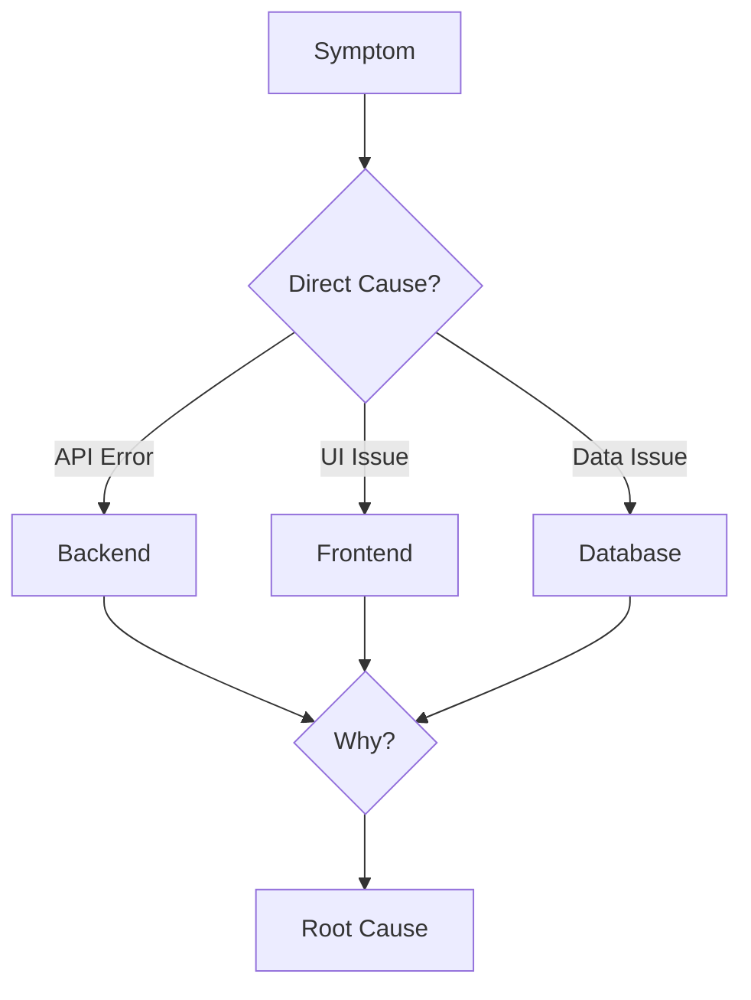

# Systematic Debugging Skill

## Overview
A structured 4-phase root cause analysis process for debugging issues in Salon_Flow. Never fix symptoms - find and fix root causes.

## Philosophy
> "Debugging is twice as hard as writing the code. So if you write code as cleverly as possible, you're not smart enough to debug it."

## The 4-Phase Process

### Phase 1: Observe & Document
```
1. What is the exact error/behavior?
2. When does it occur? (timestamp, user action)
3. Where does it occur? (component, endpoint, environment)
4. Who is affected? (all users, specific role, specific tenant)
5. What is the severity? (blocking, degraded, cosmetic)
```

**Output:** Bug Report
```markdown
## Bug Report

**Summary:** [One line description]
**Severity:** [Critical/High/Medium/Low]
**Environment:** [Production/Staging/Development]
**Affected Users:** [Description]

**Steps to Reproduce:**
1. ...
2. ...

**Expected Behavior:**
[What should happen]

**Actual Behavior:**
[What actually happens]

**Evidence:**
- Logs: [relevant log snippets]
- Screenshots: [if applicable]
- Error messages: [exact text]
```

### Phase 2: Isolate & Reproduce
```
1. Can you reproduce it locally?
2. What are the minimal steps to reproduce?
3. What components are involved?
4. What data triggers the issue?
5. Is it consistent or intermittent?
```

**Techniques:**

#### Binary Search Debugging
```python
# Comment out half the code
# If bug persists, it's in the remaining half
# If bug disappears, it's in the commented half
# Repeat until isolated
```

#### Logging Strategy
```python
import logging
logger = logging.getLogger(__name__)

# Add strategic logging points
logger.debug(f"Input: {input_data}")
logger.debug(f"After step 1: {result_1}")
logger.debug(f"After step 2: {result_2}")
```

#### Data Inspection
```python
# Print data at each transformation
print(f"Raw data: {data}")
print(f"After validation: {validated}")
print(f"After transform: {transformed}")
```

### Phase 3: Root Cause Analysis
```
1. What changed recently? (code, config, data)
2. What assumptions might be wrong?
3. What edge cases weren't considered?
4. What dependencies could fail?
5. Why did this work before?
```

**Root Cause Tracing:**



**5 Whys Technique:**
```
Problem: Booking confirmation not sent

Why 1: Email service returned error
Why 2: Email template missing salon name
Why 3: Salon name not passed to template context
Why 4: BookingService doesn't include tenant data
Why 5: Tenant context lost in async job queue

Root Cause: Async jobs don't preserve tenant context
```

### Phase 4: Fix & Verify
```
1. What is the minimal fix?
2. What tests should pass?
3. What could break?
4. How do we prevent regression?
5. Is the fix complete?
```

**Fix Checklist:**
```markdown
- [ ] Fix addresses root cause, not symptom
- [ ] Unit test added for the bug case
- [ ] Integration test if applicable
- [ ] No new warnings or errors
- [ ] Original functionality preserved
- [ ] Edge cases handled
- [ ] Documentation updated if needed
```

## Salon Context Debugging

### Common Issue Categories

| Category | Examples | Debug Focus |
|----------|----------|-------------|
| **Multi-tenant** | Data leakage, wrong salon context | Tenant ID propagation |
| **Booking** | Double booking, wrong time slots | Timezone, availability logic |
| **Auth** | Login failures, permission issues | Token validation, role checks |
| **Payment** | Failed charges, wrong amounts | Stripe integration, currency |
| **Notification** | SMS not sent, wrong recipient | Twilio, template rendering |

### Debug Commands

```bash
# Check API logs
docker logs salon-api --tail 100 -f

# Check specific tenant data
curl -H "X-Tenant-ID: salon123" http://localhost:8000/api/v1/debug/tenant

# Test booking availability
python -m pytest tests/api/test_bookings.py -v -k "availability"

# Check AI service
curl http://localhost:8001/health
```

## Anti-Patterns to Avoid

❌ Fixing symptoms without finding root cause
❌ Adding try/catch to hide errors
❌ "It works on my machine"
❌ Changing multiple things at once
❌ Skipping the reproduction step
❌ Ignoring intermittent failures

## Best Practices

✅ Always reproduce before fixing
✅ Write a failing test first
✅ Make minimal changes
✅ Verify fix with original reproduction steps
✅ Add regression test
✅ Document the root cause

## Verification Before Completion

Before marking a bug as fixed:

```markdown
## Verification Checklist

- [ ] Bug reproduced locally
- [ ] Root cause identified and documented
- [ ] Fix implemented
- [ ] Test added that would have caught the bug
- [ ] All existing tests pass
- [ ] Fix verified in staging environment
- [ ] Original reproduction steps now pass
- [ ] No new issues introduced
```
